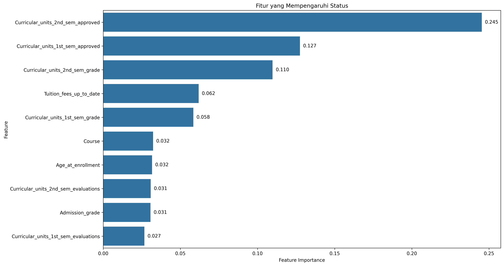

# Proyek Akhir: Menyelesaikan Permasalahan Perusahaan Edutech

## Business Understanding

**Jaya Jaya Institut** merupakan institusi pendidikan yang mengalami tantangan besar dalam menurunkan angka dropout siswa. Tingginya tingkat putus studi menjadi perhatian utama, karena berdampak langsung pada reputasi dan keberlanjutan institusi.

### Permasalahan Bisnis

- Tingginya jumlah siswa yang melakukan dropout.
- Sulitnya memantau dan mengidentifikasi siswa berisiko tinggi.
- Kurangnya sistem pendukung berbasis data untuk mengambil tindakan preventif.

### Cakupan Proyek

- Melakukan analisis data performa siswa.
- Membangun dashboard monitoring performa siswa.
- Membangun sistem prediksi kemungkinan dropout menggunakan machine learning.
- Memberikan rekomendasi berdasarkan hasil analisis.

### Persiapan

Sumber data: [dicoding_dataset/students_performance](https://github.com/dicodingacademy/dicoding_dataset/tree/main/students_performance)

Setup Enveronment

<b>Penting!</b> Pastikan di PC anda telah telah terinstall [Docker](https://www.docker.com/) dan [Python](https://www.python.org/). Jika belum ada, silahkan Download terlebih dahulu. [Link Download Docker](https://docs.docker.com/get-started/get-docker/) dan [Link Download Python](https://www.python.org/downloads/).

1. Buat File `.env` baru dari `example.env`.
   ```bash
   cp example.env .env
   ```
2. Membuat dan menjalan Virtual Enveronment
   - Linux
     ```bash
     python3 -m venv venv
     source ./venv/bin/activate
     ```
   - Windows
     ```
      python -m venv env
      venv\Scripts\activate
     ```
3. Install python packages
   ```bash
   pip install -r requirements.txt
   ```
4. Jalankan Docker compose detach mode.
   ```bash
   docker compose up -d
   ```
5. Upload dataset ke Postgres Database menggunakan perintah dibawah.
   - Linux
     ```bash
     python3 upload_data.py
     ```
   - Windows
     ```
      python upload_data.py
     ```
6. Sekaran, Anda bisa mengakses dashboard pada link berikut. [Link Dashboard](http://localhost:3000)

## Business Dashboard

Dashboard dibuat menggunakan **Metabase** untuk menampilkan metrik penting seperti rata-rata nilai per semester, jumlah evaluasi, status pembayaran, dan tingkat kelulusan mata kuliah. Dashboard ini bertujuan membantu staf akademik memantau performa dan mengidentifikasi siswa yang berisiko dropout secara visual dan intuitif.

Login:

- email: root@mail.com
- password: root123

## Menjalankan Sistem Machine Learning

Sistem prediksi dropout dibuat menggunakan algoritma Random Forest Classifier.

Untuk menjalankan prototipe:

```bash
streamlit run app.py
```

**Atau** anda dapat mengaksesnya menggunakan link berikut. [Link Streamlit Cloud](http://localhost:3000)

Model ini dilatih menggunakan data siswa dan mencapai akurasi tinggi dalam mengklasifikasikan status akhir siswa. Fitur paling berpengaruh ditunjukkan pada grafik berikut:



## Conclusion

Melalui proyek ini, saya berhasil mengidentifikasi faktor utama yang memengaruhi status siswa, membangun sistem prediksi dropout yang efektif, serta menyediakan dashboard visualisasi performa untuk membantu pengambilan keputusan akademik.

### Rekomendasi Action Items

- Fokuskan bimbingan pada siswa dengan jumlah mata kuliah disetujui rendah di semester pertama dan kedua.
- Gunakan status pembayaran sebagai indikator awal risiko dropout.
- Lanjutkan pelatihan dan evaluasi model machine learning untuk akurasi yang lebih baik.
